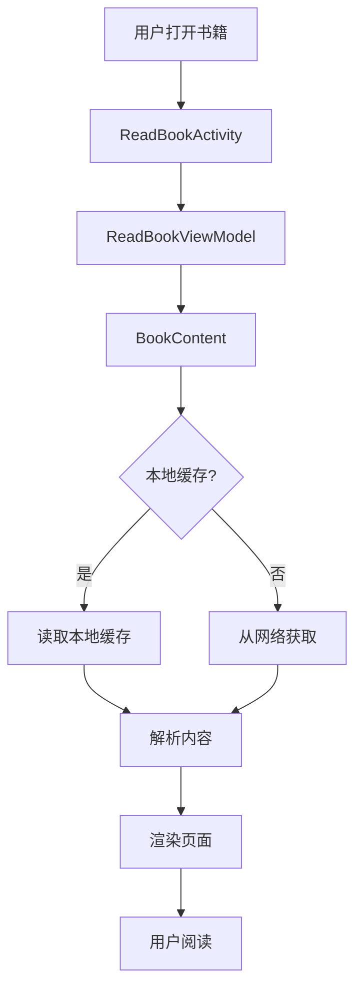
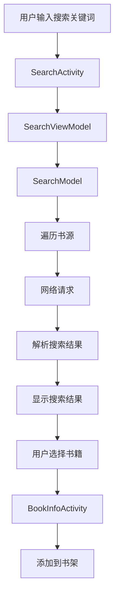

# Legado with MD3 项目架构文档

## 1. 项目概述

Legado with MD3 是基于开源项目阅读 (Legado) 开发的 Material Design 3 风格重构版本，目标是提供更加现代、流畅且一致的阅读体验。项目正在从传统 View 迁移至 Jetpack Compose 框架，并加入了多项分支独有功能。

## 2. 目录结构

项目采用标准的 Android 项目结构，主要代码位于 `app/src/main/java/io/legado/app` 目录下。以下是项目的主要目录结构：

```
io/legado/app/
├── api/             # API 接口
├── base/            # 基础类
├── constant/        # 常量定义
├── data/            # 数据层
│   ├── dao/         # 数据库访问对象
│   ├── entities/    # 实体类
│   └── repository/  # 数据仓库
├── di/              # 依赖注入
├── domain/          # 领域层
├── exception/       # 异常处理
├── help/            # 工具类
├── lib/             # 第三方库和工具
├── model/           # 业务模型
├── receiver/        # 广播接收器
├── service/         # 服务
├── ui/              # 界面层
└── App.kt           # 应用入口
```

## 3. 模块划分与职责

### 3.1 核心模块

| 模块名称 | 主要职责 | 所在目录 |
|---------|---------|---------|
| 阅读模块 | 提供书籍阅读功能，包括页面渲染、翻页、设置等 | ui/book/read/ |
| 书架模块 | 管理用户的书籍，包括添加、删除、分组等 | ui/book/ |
| 网络书籍模块 | 处理网络书籍的搜索、章节获取和内容解析 | model/webBook/ |
| 本地书籍模块 | 处理本地书籍的解析和阅读 | model/localBook/ |
| 漫画模块 | 提供漫画阅读功能 | ui/book/manga/ |
| 有声书模块 | 提供有声书播放功能 | ui/book/audio/ |
| RSS 模块 | 提供 RSS 订阅和阅读功能 | model/rss/ |

### 3.2 支持模块

| 模块名称 | 主要职责 | 所在目录 |
|---------|---------|---------|
| 数据层 | 管理应用数据，包括数据库操作和实体类 | data/ |
| 网络层 | 处理网络请求和数据获取 | help/http/ |
| 主题系统 | 提供 Material Design 3 主题支持 | lib/theme/ |
| 工具类 | 提供各种工具方法和辅助功能 | help/ |
| 服务 | 提供后台服务，如下载、缓存等 | service/ |

## 4. 架构设计

### 4.1 整体架构

项目采用典型的 Android 应用架构，遵循 MVVM (Model-View-ViewModel) 设计模式：

- **Model**：数据模型和业务逻辑，位于 `model/` 目录
- **View**：界面层，位于 `ui/` 目录，包含传统 View 和 Jetpack Compose 组件
- **ViewModel**：连接 Model 和 View 的桥梁，处理 UI 相关的业务逻辑

### 4.2 数据流

1. **用户界面**：用户通过 UI 触发操作
2. **ViewModel**：接收用户操作，处理业务逻辑
3. **Repository**：处理数据获取和存储
4. **DataSource**：从网络或本地获取数据
5. **ViewModel**：将数据转换为 UI 可显示的格式
6. **用户界面**：显示数据给用户

### 4.3 关键流程图

#### 书籍阅读流程



#### 书籍搜索流程



## 5. 模块间依赖关系

- **UI 层** 依赖 **ViewModel** 层获取数据和处理业务逻辑
- **ViewModel** 层依赖 **Repository** 层获取数据
- **Repository** 层依赖 **DataSource** 层（本地数据库或网络）
- **所有模块** 依赖 **基础模块** 提供的通用功能

## 6. 技术栈

- **开发语言**：Kotlin
- **UI 框架**：传统 View + Jetpack Compose
- **架构模式**：MVVM
- **数据库**：Room
- **网络请求**：OkHttp + Cronet
- **依赖注入**：Koin
- **图片加载**：Glide
- **音视频播放**：ExoPlayer

## 7. 未来发展方向

- 完成从传统 View 到 Jetpack Compose 的迁移
- 进一步优化 Material Design 3 风格的实现
- 增强漫画阅读和有声书功能
- 提供更多个性化设置选项

## 8. 总结

Legado with MD3 采用模块化、分层的架构设计，具有良好的可扩展性和可维护性。项目正在向现代化的 Jetpack Compose 框架迁移，同时保持了原有的核心功能和扩展性。通过清晰的模块划分和职责分离，项目能够更好地适应未来的功能扩展和技术演进。