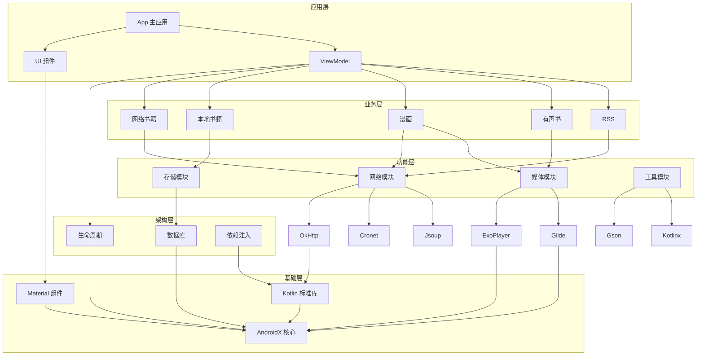

# Legado with MD3 依赖关系分析文档

## 1. 技术栈概述

Legado with MD3 项目采用现代 Android 开发技术栈，主要包括：

- **开发语言**：Kotlin
- **UI 框架**：传统 View + Jetpack Compose
- **架构模式**：MVVM (Model-View-ViewModel)
- **构建系统**：Gradle Kotlin DSL
- **最低 Android 版本**：Android 8.0 (API 26)
- **目标 Android 版本**：Android 14 (API 37)

## 2. 核心依赖库

### 2.1 基础库

| 依赖名称 | 版本 | 用途 | 来源 |
|---------|------|------|------|
| Kotlin Standard Library | - | Kotlin 标准库 | libs.kotlin.stdlib |
| Kotlinx Coroutines | - | 协程支持 | libs.bundles.coroutines |
| AndroidX Core KTX | - | AndroidX 核心功能 | libs.core.ktx |
| AndroidX Appcompat | - | 兼容性支持 | libs.appcompat.appcompat |
| Material Components | - | Material Design 组件 | libs.material |

### 2.2 架构组件

| 依赖名称 | 版本 | 用途 | 来源 |
|---------|------|------|------|
| AndroidX Lifecycle | - | 生命周期管理 | libs.lifecycle.common.java8, libs.lifecycle.service |
| AndroidX Room | - | 本地数据库 | libs.room.runtime, libs.room.ktx, libs.room.compiler |
| Koin | - | 依赖注入 | libs.koin.core, libs.koin.android, libs.koin.compose |

### 2.3 UI 相关

| 依赖名称 | 版本 | 用途 | 来源 |
|---------|------|------|------|
| Jetpack Compose | - | 现代 UI 框架 | libs.androidx.compose.ui, libs.androidx.compose.material3 |
| AndroidX RecyclerView | - | 列表视图 | libs.androidx.recyclerview |
| AndroidX ViewPager2 | - | 页面切换 | libs.androidx.viewpager2 |
| AndroidX ConstraintLayout | - | 布局管理 | libs.androidx.constraintlayout |
| Flexbox Layout | - | 弹性布局 | libs.flexbox |

### 2.4 网络相关

| 依赖名称 | 版本 | 用途 | 来源 |
|---------|------|------|------|
| OkHttp | - | 网络请求 | libs.okhttp |
| Cronet | - | 网络引擎 | cronetlib 目录下的 JAR 文件 |
| Jsoup | - | HTML 解析 | libs.jsoup |
| JsonPath | - | JSON 解析 | libs.json.path |
| JsoupXPath | - | XPath 解析 | libs.jsoupxpath |

### 2.5 媒体相关

| 依赖名称 | 版本 | 用途 | 来源 |
|---------|------|------|------|
| ExoPlayer | - | 媒体播放 | libs.media3.exoplayer |
| Glide | - | 图片加载 | libs.glide.glide, libs.glide.okhttp |
| Coil | - | 图片加载 (Compose) | libs.coil.compose, libs.coil.gif, libs.coil.svg |
| AndroidSVG | - | SVG 支持 | libs.androidsvg |

### 2.6 工具库

| 依赖名称 | 版本 | 用途 | 来源 |
|---------|------|------|------|
| Gson | - | JSON 序列化 | libs.gson |
| Kotlinx Serialization | - | Kotlin 序列化 | libs.kotlinx.serialization.json |
| LiveEventBus | - | 事件总线 | libs.liveeventbus |
| NanoHTTPD | - | 嵌入式 HTTP 服务器 | libs.nanohttpd.nanohttpd, libs.nanohttpd.websocket |
| ZXing Lite | - | 二维码扫描 | libs.zxing.lite |
| ColorPicker | - | 颜色选择器 | libs.colorpicker, libs.colorpicker.compose |
| LibArchive | - | 压缩文件处理 | libs.libarchive |
| Apache Commons Text | - | 文本处理 | libs.commons.text |
| Markwon | - | Markdown 解析 | libs.markwon.core, libs.markwon.image.glide |
| Quick Chinese Transfer | - | 简繁转换 | libs.quick.chinese.transfer.core |
| Hutool Crypto | - | 加密工具 | libs.hutool.crypto |
| Timber | - | 日志工具 | libs.timber |

### 2.7 Firebase

| 依赖名称 | 版本 | 用途 | 来源 |
|---------|------|------|------|
| Firebase Analytics | - | 应用分析 | libs.firebase.analytics |
| Firebase Performance | - | 性能监控 | libs.firebase.perf |

### 2.8 其他

| 依赖名称 | 版本 | 用途 | 来源 |
|---------|------|------|------|
| Splitties | - | 实用工具 | libs.splitties.appctx, libs.splitties.systemservices, libs.splitties.views |
| AndroidX Datastore | - | 数据存储 | libs.androidx.datastore.preferences |
| AndroidX Palette | - | 颜色提取 | libs.androidx.palette |
| AndroidX SplashScreen | - | 启动屏幕 | libs.androidx.core.splashscreen |
| AndroidX Startup | - | 组件初始化 | libs.androidx.startup.runtime |
| Accompanist WebView | - | Compose WebView | libs.accompanist.webview |
| Reorderable | - | 可拖动排序 | libs.reorderable |
| Material Kolor | - | 颜色工具 | libs.material.kolor |
| Haze | - | 模糊效果 | libs.haze.core, libs.haze.materials |
| MIUIX | - | MIUI 风格组件 | libs.miuix.ui.android, libs.miuix.preference.android |
| Capsule | - | 容器工具 | libs.capsule |
| Backdrop | - | 背景效果 | libs.backdrop |

## 3. 模块依赖关系

### 3.1 项目模块

| 模块名称 | 依赖关系 | 描述 |
|---------|----------|------|
| app | 依赖 modules:book, modules:rhino | 主应用模块 |
| modules:book | - | 书籍相关功能 |
| modules:rhino | - | JavaScript 引擎 |

### 3.2 依赖层次

1. **基础层**：Kotlin 标准库、AndroidX 核心库
2. **架构层**：Lifecycle、Room、Koin
3. **UI 层**：传统 View、Jetpack Compose、Material Components
4. **功能层**：网络、媒体、工具库
5. **业务层**：应用具体业务逻辑

## 4. 依赖关系图

## 5. 技术栈特点

### 5.1 现代化

- **Jetpack Compose**：采用最新的声明式 UI 框架，正在逐步替换传统 View
- **Kotlin**：使用 Kotlin 语言，充分利用其现代特性
- **Coroutines**：使用协程处理异步操作，提高代码可读性
- **Material Design 3**：采用最新的 Material Design 3 设计规范

### 5.2 高性能

- **Cronet**：使用 Cronet 网络引擎，提高网络请求性能
- **Glide/Coil**：使用高效的图片加载库，优化图片显示
- **ExoPlayer**：使用 ExoPlayer 处理媒体播放，提供流畅的播放体验

### 5.3 可扩展性

- **模块化设计**：将功能划分为多个模块，便于维护和扩展
- **依赖注入**：使用 Koin 进行依赖注入，提高代码可测试性
- **Room**：使用 Room 数据库，提供类型安全的数据库操作

### 5.4 功能丰富

- **多格式支持**：支持 TXT、EPUB、MOBI 等多种格式
- **网络书籍**：支持从网络获取书籍内容
- **漫画阅读**：专门优化的漫画阅读功能
- **有声书**：支持文本转语音和音频播放
- **RSS**：支持 RSS 订阅和阅读

## 6. 依赖管理

### 6.1 版本管理

项目使用 Gradle Version Catalog 管理依赖版本，通过 `libs.versions.toml` 文件集中管理所有依赖的版本信息，提高版本一致性和可维护性。

### 6.2 构建变体

项目配置了多种构建变体：

- **release**：发布版本，开启混淆和资源压缩
- **noR8**：无 R8 混淆的发布版本
- **debug**：调试版本，添加调试后缀

### 6.3 ABI 拆分

项目配置了 ABI 拆分，支持不同 CPU 架构：

- armeabi-v7a
- arm64-v8a
- 通用 APK

## 7. 总结

Legado with MD3 项目采用了现代 Android 开发技术栈，通过合理的依赖管理和模块化设计，实现了丰富的阅读功能。项目正在向 Jetpack Compose 框架迁移，同时保持了良好的性能和可扩展性。

主要技术特点包括：

- 使用 Kotlin 语言和协程处理异步操作
- 采用 MVVM 架构模式，分离关注点
- 使用 Room 数据库存储本地数据
- 集成多种网络库和解析工具，支持网络书籍和 RSS
- 提供漫画阅读和有声书功能，丰富用户体验
- 正在逐步迁移到 Jetpack Compose，实现现代化 UI

这些技术选择使得 Legado with MD3 成为一个功能强大、性能优秀的阅读应用，为用户提供了良好的阅读体验。